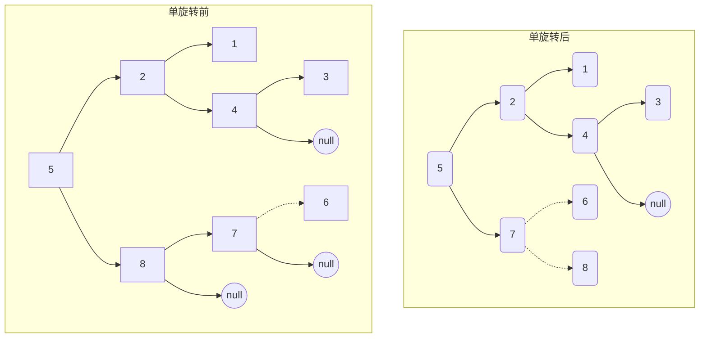
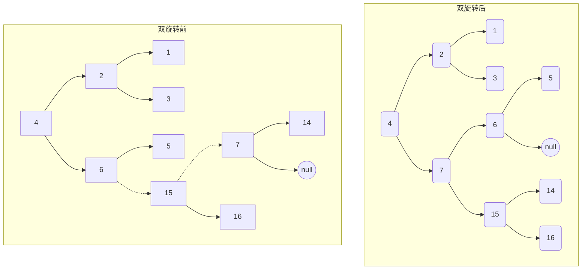

# 二叉查找树和平衡树

## 二叉查找树

> 对于树中的每个结点`X`，它的左子树中所有关键字值小于`X`的关键字值，而它的右子树中所有关键字值大于`X`的关键字值

> 二叉查找树的平均深度 $O(log_2N)$

```c
#include<stdio.h>
#include<stdlib.h>

typedef struct TreeNode *Tree;
typedef struct TreeNode TreeNode;
struct TreeNode
{
    int element;
    Tree left;
    Tree right;
};

// Find 查找指向树T中具有关键字X的结点的指针,如果这样的结点不存在则返回NULL
Tree Find(int x, Tree t)
{
    if (t == NULL)
    {
        return NULL;
    }
    if (x < t->element)
    {
        return Find(x, t->left);
    } else if (x > t->element)
    {
        return Find(x, t->right);
    }
    return t;
}

// FindMin 返回最小元的结点的指针
Tree FindMin(Tree t)
{
    if (t == NULL)
    {
        return NULL;
    }
    if (t->left == NULL)
    {
        return NULL;
    }
    return FindMin(t->left);
}

// FindMax 返回最大元的结点的指针
Tree FindMax(Tree t)
{
    if (t == NULL)
    {
        return NULL;
    }
    Tree cur = t;
    while (cur->right != NULL)
    {
        cur = cur->right;
    }
    return cur;
}

// Insert 插入元素x
Tree Insert(int x, Tree t)
{
    if (t == NULL)
    {
        Tree t = (Tree)malloc(sizeof(TreeNode));
        if (t == NULL)
        {
            printf("out of space!!!\n");
            return NULL;
        }
        t->element = x;
        t->left = NULL;
        t->right = NULL;
        return t;
    }
    if (x < t->element)
    {
        t->left = Insert(x, t->left);
    }
    if (x > t->element)
    {
        t->right = Insert(x, t->right);
    }
    return t;
}

// Delete 删除指定结点
Tree Delete(int x, Tree t)
{
    Tree tmpCell;
    if (t == NULL)
    {
        return NULL;
    }
    if (x == t->element)
    {
        // 该结点有两个子结点
        // 一般的删除策略是用其右子树的最小的数据代替该结点的数据并递归的删除那个结点
        if (t->left != NULL && t->right != NULL)
        {
            tmpCell = FindMin(t->right);
            t->element = tmpCell->element;
            t->right = Delete(t->element, t->right);
        } else
        {
            tmpCell = t;
            if (t->left == NULL)
            {
                t = t->right;
            } else if (t->right==NULL)
            {
                t = t->left;
            }
            free(tmpCell);
        }
    }
    if (x > t->element)
    {
        t->right = Delete(x, t->right);
    }
    if (x < t->element)
    {
        t->left = Delete(x, t->left);
    }
    return t;
}
```

## 平衡树

> AVL树是带有平衡条件的二叉查找树，这个平衡条件必须要容易保持，而且它须保证树的深度是 $O(log_2N)$

*   一颗AVL树是其每个结点的左右子树的高度最多差1的二叉查找树
*   在高度为`h`的AVL树中，最少结点数`S(h)`由`S(h)=S(h-1) + S(h-2) + 1`给出。对于`h=0, S(h)=1`; `h=1, S(h)=2`

### 重建平衡

不平衡的四种情况:

> 1和4是镜像对称，2和3是镜像对称，因此理论上只有两种情况

1.  左子树的左子树进行一次插入
2.  左子树的右子树进行一次插入
3.  右子树的左子树进行一次插入
4.  右子树的右子树进行一次插入

<font style="color:red;">**第一种**</font>情况是插入发生在“外边”的情况（即左-左或者右-右的情况），该情况下仅需通过对树的一次单旋转即可完成调整



<font style="color:red;">**第二种**</font>情况是发生在“内部“的情形，该情况需要通过稍微复杂的双旋转来处理



```c
#include <stdio.h>
#include <stdlib.h>

typedef struct AvlNode *AvlTree;
typedef struct AvlNode AvlNode;
struct AvlNode
{
    int element;
    int height;
    AvlTree left;
    AvlTree right;
};

// Find 查找指向树T中具有关键字X的结点的指针,如果这样的结点不存在则返回NULL
AvlTree Find(int x, AvlTree t)
{
    if (t == NULL)
    {
        return NULL;
    }
    if (x < t->element)
    {
        return Find(x, t->left);
    }
    else if (x > t->element)
    {
        return Find(x, t->right);
    }
    return t;
}

// FindMin 返回最小元的结点的指针
AvlTree FindMin(AvlTree t)
{
    if (t == NULL)
    {
        return NULL;
    }
    if (t->left == NULL)
    {
        return NULL;
    }
    return FindMin(t->left);
}

// FindMax 返回最大元的结点的指针
AvlTree FindMax(AvlTree t)
{
    if (t == NULL)
    {
        return NULL;
    }
    AvlTree cur = t;
    while (cur->right != NULL)
    {
        cur = cur->right;
    }
    return cur;
}

int height(AvlTree t)
{
    if (t == NULL)
    {
        return -1;
    }
    return t->height;
}

int max(int a, int b)
{
    if (a > b)
    {
        return a;
    }
    return b;
}

// 左子树的左子树进行插入导致平衡树失衡
// 1. 指针p暂存该树根结点的左子树结点
// 2. 该树根结点的左子树的右子树作为根结点的左子树
// 3. 该树根结点作指针p的右子树
// 4. 指针p作为该树新的根结点
AvlTree singleRotateWithLeft(AvlTree t)
{
    AvlTree p;
    p = t->left;
    t->left = p->right;
    p->right = t;

    t->height = max(height(t->left), height(t->right)) + 1;
    p->height = max(height(p->left), height(p->right)) + 1;

    return p;
}

// 右子树的右子树进行插入导致平衡树失衡
// 1. 指针p暂存该树根结点的右子树结点
// 2. 该树根结点的右子树的左子树作为根结点的右子树
// 3. 该树根结点作指针p的左子树
// 4. 指针p作为该树新的根结点
AvlTree singleRotateWithRigth(AvlTree t)
{
    AvlTree p;
    p = t->right;
    t->right = p->left;
    p->left = t;

    t->height = max(height(t->left), height(t->right)) + 1;
    p->height = max(height(p->left), height(p->right)) + 1;

    return p;
}

// 右子树的左子树进行插入导致平衡树失衡
// 1. 针对该树根结点的左子树进行旋转
// 2. 针对该树根结点进行旋转
AvlTree doubleRotateWithLeft(AvlTree t)
{
    t->left = singleRotateWithRigth(t->left);
    return singleRotateWithLeft(t);
}

// 左子树的右子树进行插入导致平衡树失衡
// 1. 针对该树根结点的右子树进行一次旋转
// 2. 针对该树根结点进行旋转
AvlTree doubleRotateWithRigth(AvlTree t)
{
    t->right = singleRotateWithLeft(t->right);
    return singleRotateWithRigth(t);
}

// Insert 插入元素x
AvlTree Insert(int x, AvlTree t)
{
    if (t == NULL)
    {
        AvlTree t = (AvlTree)malloc(sizeof(AvlNode));
        if (t == NULL)
        {
            printf("out of space!!!\n");
            return NULL;
        }
        t->element = x;
        t->left = NULL;
        t->right = NULL;
        return t;
    }
    if (x < t->element)
    {
        t->left = Insert(x, t->left);
        if (height(t->left) - height(t->right) == 2)
        {
            // 左子树的左子树插入结点
            if (x < t->left->element)
            {
                t = singleRotateWithLeft(t);
            }
            // 左子树的右子树插入结点(双旋转)
            else
            {
                t = doubleRotateWithLeft(t);
            }
        }
    }
    if (x > t->element)
    {
        t->right = Insert(x, t->right);
        if (height(t->right) - height(t->left) == 2)
        {
            // 右子树的右子树插入结点
            if (x > t->right->element)
            {
                t = singleRotateWithRigth(t);
            }
            // 右子树的左子树插入结点(双旋转)
            else
            {
                t = doubleRotateWithRigth(t);
            }
        }
    }
    if (height(t->left) > height(t->right))
    {
        t->height = height(t->left) + 1;
    }
    else
    {
        t->height = height(t->right) + 1;
    }
    return t;
}

// Delete 删除指定结点
AvlTree Delete(int x, AvlTree t)
{
    AvlTree tmpCell;
    if (t == NULL)
    {
        return NULL;
    }
    if (x == t->element)
    {
        // 该结点有两个子结点
        // 一般的删除策略是用其右子树的最小的数据代替该结点的数据并递归的删除那个结点
        if (t->left != NULL && t->right != NULL)
        {
            tmpCell = FindMin(t->right);
            t->element = tmpCell->element;
            t->right = Delete(t->element, t->right);
        }
        else
        {
            tmpCell = t;
            if (t->left == NULL)
            {
                t = t->right;
            }
            else if (t->right == NULL)
            {
                t = t->left;
            }
            free(tmpCell);
        }
    }
    if (x > t->element)
    {
        t->right = Delete(x, t->right);
    }
    if (x < t->element)
    {
        t->left = Delete(x, t->left);
    }
    return t;
}
```

