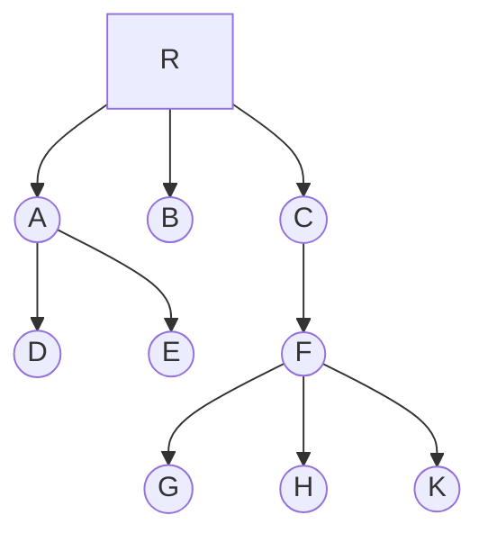

# 定义

树是n个结点的有限集，或为空树；或为非空树，对于非空树：

> <font style="color:red;">根节点深度是1</font>

*   有且仅有一个根结点
*   除根结点以外的其余结点可分为m个互不相交的有限集，每个有限集又是一棵树，并且称为根的子树
*   **深度**：指从根节点到该节点的最长简单路径边的条数
*   **高度**：指从该节点到叶子节点的最长简单路径边的条数

# 二叉树

> 树的特殊形式，仅有左右两棵子树

二叉树和树的区别如下：

*   二叉树每个结点至多只有两棵子树
*   二叉树的子树有左右之分，其次序不能任意颠倒

## 二叉树的性质

*   在二叉树的第`i`层至多有 $2^{i-1}$个结点$(i \ge 1)$
*   深度为`k`的二叉树至多有$2^k-1$个结点$(k \ge 1)$
*   对任何一棵二叉树T，其终端结点树为$n_0$,度为2的结点树为$n_2$，则$n_0 = n_2 + 1$
*   具有n个结点的完全二叉树的深度为$\lfloor log_2n \rfloor + 1$
*   如果对一棵有n个结点的完全二叉树的结点按层序编号，则对任一结点$i(1 \le i \le n)$有：
    *   如果`i=1`,则结点`i`是二叉树的根，无双亲；如果`i > 1`, 则双亲是结点$\lfloor i/2 \rfloor$
    *   如果`2i>n`，则结点`i`无左孩子(结点`i`为叶子结点)，否则其左孩子是结点`2i`
    *   如果`2i+1>n`,则结点`i`无右孩子；否则其右孩子是结点`2i+1`

### 满二叉树

> 深度为`k`且含有 $2^k-1$ 个结点的二叉树

#### 特点

*   每一层上的结点数都是最大结点数，即每一层`i`的结点数都具有最大值$2^{i-1}$

### 完全二叉树

> 深度为`k`的有`n`个结点的二叉树，当且仅当其每一个结点都与深度为`k`的满二叉树中编号从1到n的结点一一对应时，称之为完全二叉树

#### 特点

*   叶子结点只可能在层次最大的两层出现
*   对任一结点，若其右分支下的子孙的最大层次为`l`, 则其左分支下的子孙的最大层次比为`l`或`l+1`

### 二叉树链表存储表示

```c
typedef struct BiNode {
    ElemType data; // ElemType: 用户自定义类型
    struct BiNode *lchild, *rchild; // 左右孩子指针
}BiNode, *BiTree;
```

#### 创建二叉树

##### 先序遍历方式

```c
typedef struct BiNode {
    char data; // ElemType: 用户自定义类型
    struct BiNode *lchild, *rchild; // 左右孩子指针
}BiNode, *BiTree;

BiTree Create()
{
    char data;
    scanf("%c", &data);
    if (data == '#')
    {
        return NULL;
    }
    BiTree head = (BiTree)malloc(sizeof(BiNode));
    head->data = data;
    head->lchild = Create();
    head->rchild = Create();
    return head;
}
```

#### 遍历二叉树

##### 先序遍历

**步骤**

*   访问根结点
*   先序遍历左子树
*   先序遍历右子树

```c
void PreOrderTraverse(BiTree t)
{
    if (t != NULL)
    {
        printf("%d\t", t->data);
        InOrderTraverse(t->lchild);
        InOrderTraverse(t->rchild);
    }
}
```

##### 中序遍历

**步骤**

*   中序遍历左子树
*   访问根结点
*   中序遍历右子树

```c
// InOrderTraverse 递归遍历
void InOrderTraverse(BiTree t)
{
    if (t != NULL)
    {
        InOrderTraverse(t->lchild);
        printf("%d\t", t->data);
        InOrderTraverse(t->rchild);
    }
}

// InOrderTraverse2 非递归
void InOrderTraverse2(BiTree t)
{
    InitStack(s);
    BiTree p = t;
    BiTree q = (BiTree)malloc(sizeof(BiNode));
    while (p != NULL && !StackEmpty(s))
    {
        if (p != NULL)
        {
            Push(s, p); // 根指针入栈
            p = p->lchild; // 遍历左子树
        }
        else
        {
            Pop(s, q); // 获取栈顶指针
            printf("%d\t", q->data);
            p = q->rchild; // 遍历右子树
        }
    }
}
```

##### 后序遍历

**步骤**

*   后序遍历左子树
*   后序遍历右子树
*   访问根结点

```c
void PostOrderTraverse(BiTree t)
{
    if (t != NULL)
    {
        InOrderTraverse(t->lchild);
        InOrderTraverse(t->rchild);
        printf("%d\t", t->data);
    }
}
```

##### 层序遍历

> 借助链表实现层序遍历

**步骤**

*   根结点作为链表头结点
*   遍历链表
    *   取链表头结点，打印结点内容
    *   该结点左孩子不为空，追加到链表尾
    *   该结点右孩子不为空，追加到链表尾

```c
typedef struct BiNode {
    char data;
    struct BiNode *lchild, *rchild; // 左右孩子指针
}BiNode, *BiTree;

void SequeueTraverse(BiTree t)
{
    if (t == NULL)
    {
        return;
    }

    LinkQueue *q = (LinkQueue*)malloc(sizeof(LinkQueue));
    InitQueue(q);
    Push(q, t);

    BiTree node;
    while (q->front != q->rear)
    {
        Pop(q, &node);
        printf("%c\t", node->data);
        if (node->lchild != NULL)
        {
            Push(q, node->lchild);
        }
        if (node->rchild != NULL)
        {
            Push(q, node->rchild);
        }
    }
}
```

#### 计算二叉树的深度

> 二叉树的深度为树中结点的最大层次，二叉树的深度为左右子树深度的较大者加1

**步骤**

*   如果是空树，递归结束，返回0。否则执行以下步骤：
    *   递归计算左子树深度, 计为`m`
    *   递归计算右子树深度, 计为`n`
    *   如果`m>n`，则二叉树深度为`m+1`，否则为`n+1`

```c
int Depth(BiTree t)
{
    if (t == NULL)
    {
        return 0;
    }
    int m = Depth(t->lchild);
    int n = Depth(t->rchild);
    if (m > n)
    {
        return m + 1;
    }
    return n + 1;
}
```

#### 统计二叉树中结点的个数

```c
int NodeCount(BiTree t)
{
    if (t == NULL)
    {
        return 0;
    }
    return NodeCount(t->lchild) + NodeCount(t->rchild) + 1;
}
```

#### 统计二叉树中叶子结点个数

```c
int NodeLeafCount(BiTree t)
{
    if (t == NULL)
    {
        return 0;
    }
    if (t->lchild == NULL && t->rchild == NULL)
    {
        return 1;
    }
    return NodeLeafCount(t->lchild) + NodeLeafCount(t->rchild);
}
```

#### 统计二叉树中度为1的结点树

```c
int NodeDegreeCount(BiTree t)
{
    if (t == NULL)
    {
        return 0;
    }
    if ((t->lchild != NULL && t->rchild == NULL) || (t->lchild == NULL && t->rchild != NULL))
    {
        return 1;
    }
    return NodeDegreeCount(t->lchild) + NodeDegreeCount(t->rchild);
}
```

### 线索二叉树

> 有`n`个结点的二叉链表中必定存在`n+1`个空链域

> **规定:** 若结点有左子树，则其`lchild`域指示其坐孩子，否则令`lchild`域指示其前驱；若结点有右子树，则其`rchild`指示其右孩子，否则令`rchild`域指示其后继

线索二叉树的结点形式:

| child | lTag | data | rchild | rTag |
| ----- | ---- | ---- | ------ | ---- |

其中:

$$
lTag = \begin{cases}
0 \qquad lchild \text{域指示结点的左孩子} \\
1 \qquad lchild \text{域指示结点的前驱}
\end{cases}
$$

$$
rTag = \begin{cases}
0 \qquad rchild \text{域指示结点的右孩子} \\
1 \qquad rchild \text{域指示结点的后继}
\end{cases}
$$

类型定义:
```c
typedef struct BiThrNode
{
    TElemType data; // TElemType用户自定义类型
    struct BiThrNode *lchild, *rchild; // 左右孩子指针
    int lTag, rTag; // 左右标识
}BiThrNode, *BiThrTree;
```

#### 二叉树中序线索化

##### 以结点p为根的子树中序线索化

*   如果`p`非空，左子树递归线索化
*   如果`p`的左孩子为空，则给`p`加上左线索，将其`lTag`置为1，让`p`的左孩子指针指向`pre`(前驱)；否则将`p`的`lTag`置为0
*   如果`pre`的右孩子为空，则给`pre`加上右线索，将其`rTag`置为1，让`pre`的右孩子指针指向`p`(后继)；否则将`pre`的`rTag`置为0
*   将`pre`指向刚访问过的结点`p`，即`pre=p`
*   右子树递归线索化

```c
BiThrTree pre;

// visit 访问结点p
void visit(BiThrTree p)
{
    if (p->lchild == NULL)
    {
        p->lTag = 1;
        p->lchild = pre;
    }
    else
    {
        p->lTag = 0;
    }
    if (pre != NULL)
    {
        if (pre->rchild == NULL)
        {
            pre->rTag = 1;
            pre->rchild = p;
        }
        else
        {
            pre->rTag = 0;
        }
    }
    pre = p;
}

void InThreading(BiThrTree p)
{
    if (p == NULL)
    {
        return;
    }
    InThreading(p->lchild);
    visit(p);
    InThreading(p->rchild);
}
```

##### 带头结点的二叉树中序线索化

```c
BiThrTree InOrderThreading(BiThrTree t)
{
    BiThrTree thrt = (BiThrTree)malloc(sizeof(BiThrNode));
    thrt->lTag = 0;
    thrt->rTag = 1;
    thrt->rchild = thrt;
    if (t == NULL)
    {
        thrt->lchild = thrt;
        return thrt;
    }

    thrt->lchild = t;
    // pre初始值指向头结点
    pre = thrt;
    InThreading(t);
    // 对以t为根的二叉树线索化后,pre为最右结点,pre的右线索指向头结点
    pre->rchild = thrt;
    pre->rTag = 1;
    // 头结点的右线索指向pre
    thrt->rchild = pre;

    return thrt;
}
```

#### 遍历线索二叉树

> 在先序线索二叉树上找前驱或者在后序线索二叉树上找后继都比较复杂

##### 在先序线索二叉树中查找

1.  查找`p`指针所指结点的前驱

*   若`p->lTag`为1，则`p`的左链指示其前驱
*   若`p->lTag`为0, 则说明`p`有左子树。此时`p`的前驱有两种情况：
    *   若`p`是其双亲的左孩子，则其前驱为其双亲结点
    *   否则为其双亲的左子树上先序遍历最后访问到的结点

1.  查找`p`指针所指结点的后缀

*   若`p->rTag`为1，则`p`的右链指示其后缀
*   若`p->rTag`为0，则说明`p`有右子树。按照先序遍历的规则可知，`p`的后继比为其左子树根(若存在)或者右子树根

##### 在中序线索二叉树中查找

1.  查找`p`指针所指结点的前驱

*   若`p->lTag`为1，则`p`的左链指示其前驱
*   若`p->lTag`为0, 则说明`p`有左子树，结点的前驱是遍历左子树最后时访问的一个结点(左子树最右下的结点)

1.  查找`p`指针所指结点的后缀

*   若`p->rTag`为1，则`p`的右链指示其后缀
*   若`p->rTag`为0，则说明`p`有右子树。根据中序遍历的规律可知，结点的后继是遍历其右子树时访问的第一个结点，即右子树最左下的结点

##### 在后序线索二叉树中查找

1.  查找`p`指针所指结点的前驱

*   若`p->lTag`为1，则`p`的左链指示其前驱
*   若`p->lTag`为0
    *   当`p->rTag`为0时，则`p`的右链指示其前驱
    *   当`p->rTag`为1时，则`p`的左链指示其前驱

1.  查找`p`指针所指结点的后缀

*   若`p`是二叉树的根，则其后继为空
*   若`p`是其双亲的右孩子，则其后继为双亲结点
*   若`p`是其双亲的左孩子且其双亲没有右孩子，则其后继为双亲结点
*   若`p`是其双亲的左孩子且其双亲有右孩子，则其后继为双亲的右子树上按后序遍历列出的第一个结点(即右子树中最左下的结点)

```c
// 中序遍历二叉线索树的非递归算法
// 1、指针p指向根结点
// 2、p为非空树或者遍历为结束时，循环执行以下操作
//    2.1、沿左孩子向下，到达最左下结点p, 它是中序的第一个结点
//    2.2、访问p
//    2.3、沿右线索反复查找当前结点的后继结点并访问后继结点，直至右线索为0或者遍历结束
//    2.4、转向p的右子树
void InOrderTraverse_Thr(BiThrTree t)
{
    BiThrTree p = t->lchild;
    while (p != T)
    {
        while (p->lTag == 0)
        {
            p = p->lchild;
        }
        printf("%c\t", p->data);
        while(p->rTag == 1 && p->rchild != T)
        {
            p = p->rchild;
            printf("%c\t", p->data);
        }
        p = p->rchild;
    }
}
```

# 树和森林

> 任何树中，分支数比节点数少1

## 树的存储结构

### 双亲表示法

> 以一组连续的存储单元存储树的特点，每个结点除了数据域`data`外，还附设一个`parent`域用以指示其双亲结点的位置，其结点形式如下：

***

| data | parent |
| ---- | ------ |

***

**树的双亲表示法示例**

| 数组下标 | 数据域 | 双亲结点位置 |
| ---- | --- | ------ |
| 0    | R   | -1     |
| 1    | A   | 0      |
| 2    | B   | 0      |
| 3    | C   | 0      |
| 4    | D   | 1      |
| 5    | E   | 1      |
| 6    | F   | 3      |
| 7    | G   | 6      |
| 8    | H   | 6      |
| 9    | K   | 6      |



### 孩子表示法

> 由于树中每个结点可能有多棵子树，则可用多重链表，即每个结点有多个指针域，其中每个指针指向一棵子树的根结点，此时链表中的结点如下所示:

***

| data | child1 | child2 | ... | childd |
| ---- | ------ | ------ | --- | ------ |

<br />

| data | degree | child1 | child2 | ... | childd |
| ---- | ------ | ------ | ------ | --- | ------ |

***

1.  若采用第一种结点格式，则多重链表中的结点是同构的，其中`d`为树的度。由于树中很多结点的度小于`d`，所以链表中有很多空链域，空间较浪费，不难推出，在一棵有`n`个结点度为`k`的树中必有`n(k-1)+1`个空域链
2.  若采用第二种结点格式，把多重链表中的结点是不同构的，其中`d`为结点的度，`degree`域的值同`d`。此时虽能节约存储空间，但操作不方便。


### 孩子兄弟法[二叉树表示法|二叉链表表示法]

> 链表中结点的两个链域分别指向该结点的第一个孩子结点和下一个兄弟结点，分别命名为`firstchild`域和`nextsibling`域，其结点形式如下:

| firstchild | data | nextsibling |
| ---------- | ---- | ----------- |

```c
typedef struct CSNode
{
    ElemType data; // ElemType用户自定义类型
    struct CSNode *firstchild, *nextsibling;
}CSNode, *CSTree;
```


## 森林与二叉树的转换

从树的二叉链表表示的定义可知，任何一棵和树对应的二叉树，其根结点的右子树必空。若把树中第二棵树看成第一个树的根结点的兄弟，则同样可导出森林和二叉树的关系

### 森林转换成二叉树

如果$F=\{T_1, T_2, \cdots, T_m\}$是森林，则可按照如下规则转换成一棵二叉树`B=(root, LB, RB)`

*   如果`F`为空，即`m=0`，则`B`为空树
*   若`F`非空，即$m \neq 0$，则:
    *   `B`的根结点为第一棵树的根结点
    *   `B`的左子树是从$T_1$中根结点的子树森林$F_1=\{T_{11}, T_{12}, \cdots, T_{1m}\}$转换而成的二叉树
    *   `B`的右子树是从森林$F'=\{T_{2'}, T_{3'}, \cdots, T_{m}\}$转换而成的二叉树

### 二叉树转换成森林

如果`B=(root, LB, RB)`是一棵二叉树，则可按如下规则转换成森林:

*   若`B`为空，则`F`为空
*   若`B`非空
    *   `F`中第一棵树$T_1$的根结点即为二叉树`B`的根结点
    *   $T_1$中根结点的子树森林$F_1$是右`B`的左子树`LB`转换而成的森林
    *   `F`中除$T_1$之外其余树组成的森林$F'=\{T_{2'}, T_{3'}, \cdots, T_{m}\}$是右`B`的右子树转换而成的森林

## 树和森林的遍历

### 树的遍历

*   先根遍历树：先访问树的根结点，然后依次先根遍历根的每棵子树
*   后根遍历树：先依次后根遍历每棵子树，然后访问根结点

### 森林的遍历

*   先序遍历森林
    *   访问森林中第一棵树的根结点
    *   先序遍历第一棵树的根结点的子树森林
    *   先序遍历除去第一棵树之后剩余的树构成的森林
*   中序遍历森林
    *   中序遍历森林中第一棵树的根结点的子树森林
    *   访问根结点
    *   中序遍历除去第一棵树之后剩余的树构成的森林

## 哈夫曼树

哈夫曼树又称最优树，是一类带权路径长度最短的树。哈夫曼树中没有度为1的结点，则一棵有`n`个叶子结点的哈夫曼树共有<font style="color:red;">**`2n-1`**</font>个结点。

### 概念

1.  **路径:** 从树中一个结点到另一个结点之间的分支构成这两个结点之间的路径
2.  **路径长度:** 路径上的分支数称作路径长度
3.  **树的路径长度:** 从树根到每一结点的路径长度之和
4.  **权:** 分为结点（元素）和边（关系）两大类，故有结点权和边权
5.  **结点的带权路径长度:** 从该结点到树根之间的路径长度与结点上权的成绩
6.  **树的带权路径长度:** 树中所有叶子结点的带权路径长度之和。通常记作$WPL=\sum_{k=1}^nw_kl_k$
7.  **哈夫曼树:** 假设有`m`个权值$\{w_1, w_2, \cdots, w_m\}$，可以构造一棵含有`n`个叶子结点的二叉树，每个叶子结点的权为$w_i$，则其中带权路径长度`WPL`最小的二叉树称作最优二叉树或哈夫曼树

### 构造算法

*   根据给定的`n`个权值$\{w_1, w_2, \cdots, w_n\}$, 构造`n`棵只有根结点的二叉树，这`n`棵二叉树构成一个森林F
*   在森林F中选取两棵根结点的权值最小的树作为左右子树构造一棵二叉树，且置新的二叉树的根结点的权值为其左、右子树上根结点的权值之和
*   在森林F中删除这两棵树，同时将新得到的二叉树加入F中
*   重复前两个操作，直到F只含一棵树为止。这棵树便是哈夫曼树

### 哈夫曼算法实现

**哈夫曼树结点形式**

| weight | parent | lchild | rchild |
| ------ | ------ | ------ | ------ |

**哈夫曼树的存储表示**

```c
typedef struct HTNode
{
    int weight; // 结点权值
    int parent, lchild, rchild; // 结点的双亲、左孩子、右孩子的下标
}HTNode,*HuffmanTree;
```

**哈夫曼树的构建**

```c
typedef struct HTNode
{
    int weight;                 // 结点权值
    struct HTNode *lchild, *rchild; // 结点的双亲、左孩子、右孩子的下标
} HTNode, *HuffmanTree;

HuffmanTree createHuffmanTree(int arr[], int n)
{
    HuffmanTree forest[n];
    HuffmanTree root = NULL;

    // 构造森林
    for (int i = 0; i < n; i++)
    {
        HuffmanTree temp;
        temp = (HuffmanTree)malloc(sizeof(HTNode));
        temp->weight = arr[i];
        temp->lchild = temp->rchild = NULL;
        forest[i] = temp;
    }

    // 构建树
    for (int i = 1; i < n; i++)
    {
        // minn为最小值树根下标
        int minn = -1;
        // minnSub为次小值树根下标
        int minnSub = 0;

        // 获取数组中前两个不为空的结点
        for (int j = 0; j < n; j++)
        {
            if (forest[j] != NULL && minn == -1)
            {
                minn = j;
                continue;
            }
            if (forest[j] != NULL)
            {
                minnSub = j;
                break;
            }
        }

        // 寻找权值最小的两个结点
        for (int j = minnSub; j < n; j++)
        {
            if (forest[j] == NULL)
            {
                continue;
            }
            if (forest[j]->weight < forest[minn]->weight)
            {
                minnSub = minn;
                minn = j;
            }
            else if (forest[j]->weight < forest[minnSub]->weight)
            {
                minnSub = j;
            }
        }

        // 建新树
        root = (HuffmanTree)malloc(sizeof(HTNode));
        root->weight = forest[minn]->weight + forest[minnSub]->weight;
        root->lchild = forest[minn];
        root->rchild = forest[minnSub];

        forest[minn] = root;    // 指向新树的指针赋给 minn 位置
        forest[minnSub] = NULL; // minnSub 位置为空
    }

    return root;
}
```

**哈夫曼编码**

> 编码思想：为出现次数较多的字符编以较短的编码

> 约定左分支标记为0，右分支标记为1，则根结点到每个叶子结点路径上的0，1序列即位相应字符的编码

性质:

*   哈夫曼编码是前缀编码（即任一个编码都不是其他编码的前缀[最左子串]）
*   哈夫曼编码是最优前缀编码

```c
void huffmanCode(HuffmanTree ht, int len, int arr[])
{
    if (ht == NULL)
    {
        return;
    }
    if (ht->lchild == NULL && ht->rchild == NULL)
    {
        for (int i = 0; i < len; i++)
        {
            printf("%d", arr[i]);
        }
        printf("\n");
    }
    else
    {
        arr[len] = 0;
        huffmanCode(ht->lchild, len+1, arr);
        arr[len] = 1;
        huffmanCode(ht->rchild, len+1, arr);
    }
}
```

